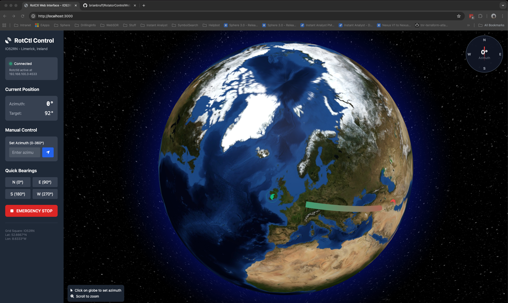

# RotCtl Web Interface

A web-based control interface for remote antenna rotor control via rotctld daemon, featuring an interactive 3D globe visualization.



## Features

- 🌍 **3D Interactive Globe** - Visual beam heading from your QTH location
- 🎯 **Click-to-Point** - Simply click anywhere on the globe to set azimuth
- 📡 **Real-time Tracking** - Live rotor position updates
- 🎛️ **Manual Controls** - Precise azimuth input and quick bearing buttons
- 🛑 **Emergency Stop** - Instant rotor stop with dedicated button or ESC key
- 🔒 **Secure Access** - Basic authentication protection
- 🔄 **Auto-reconnect** - Automatic connection recovery to rotctld

## Prerequisites

- Node.js (v14 or higher) OR Docker
- rotctld daemon running on your network
- Modern web browser

## Quick Start

### Option 1: Docker (Recommended)

1. Clone the repository:
```bash
git clone https://github.com/brianbruff/RotatorControlWeb.git
cd RotatorControlWeb
```

2. Create your `.env` file:
```bash
cp .env.example .env
# Edit .env with your settings
```

3. Run with Docker Compose:
```bash
docker-compose up -d
```

4. Access the interface at `http://localhost:3000`

### Option 2: Docker Build

```bash
# Build the image
docker build -t rotctl-web .

# Run the container
docker run -d \
  --name rotctl-web \
  -p 3000:3000 \
  -e AUTH_USERNAME=admin \
  -e AUTH_PASSWORD=your_password \
  -e ROTCTLD_HOST=192.168.100.3 \
  -e ROTCTLD_PORT=4533 \
  rotctl-web
```

### Option 3: Node.js

1. Clone and install:
```bash
git clone https://github.com/brianbruff/RotatorControlWeb.git
cd RotatorControlWeb
npm install
```

2. Configure:
```bash
cp .env.example .env
# Edit .env with your settings
```

3. Run:
```bash
npm start
```

## Configuration

Edit the `.env` file with your settings:

```bash
# Authentication (CHANGE THESE!)
AUTH_USERNAME=admin
AUTH_PASSWORD=your_secure_password_here

# Rotctld Connection
ROTCTLD_HOST=192.168.100.3
ROTCTLD_PORT=4533

# QTH Location
QTH_LATITUDE=52.6667
QTH_LONGITUDE=-8.6333
QTH_GRID_SQUARE=IO52RN
QTH_LOCATION_NAME=Limerick, Ireland
```

**Important:** Never commit the `.env` file to version control!

## Usage

### Interface Overview

The interface consists of:
- **3D Globe** (right): Interactive earth visualization with beam heading
- **Control Panel** (left): Status, position display, and manual controls
- **Compass** (top-right): Visual azimuth indicator

### Controls

#### Globe Interaction
- **Click**: Set antenna azimuth to clicked location
- **Scroll**: Zoom in/out
- **Drag**: Rotate globe view

#### Manual Controls
- **Azimuth Input**: Enter precise azimuth (0-360°)
- **Quick Bearings**: N (0°), E (90°), S (180°), W (270°)
- **Emergency Stop**: Red button stops rotor immediately

#### Keyboard Shortcuts
- `ESC` - Emergency stop
- `Ctrl+S` - Emergency stop
- `Enter` - Submit manual azimuth (when input focused)

## Docker Deployment

### Docker Compose (Recommended)

The included `docker-compose.yml` provides easy deployment:

```yaml
version: '3.8'
services:
  rotctl-web:
    build: .
    ports:
      - "3000:3000"
    environment:
      - AUTH_USERNAME=${AUTH_USERNAME:-admin}
      - AUTH_PASSWORD=${AUTH_PASSWORD:-changeme}
      - ROTCTLD_HOST=${ROTCTLD_HOST:-192.168.100.3}
      - ROTCTLD_PORT=${ROTCTLD_PORT:-4533}
    restart: unless-stopped
```

### Building for Production

```bash
# Build image
docker build -t rotctl-web:latest .

# Tag for registry
docker tag rotctl-web:latest your-registry/rotctl-web:latest

# Push to registry
docker push your-registry/rotctl-web:latest
```

## Rotctld Integration

This interface communicates with rotctld using these commands:
- `p` - Get current rotor position
- `P <azimuth> 0` - Set rotor position
- `S` - Stop rotor movement

Ensure your rotctld daemon is:
1. Running and accessible on the network
2. Configured to accept connections from this application
3. Not blocked by firewall rules

## Status Indicators

- 🟢 **Green (pulsing)** - Connected to rotctld
- 🔴 **Red** - Disconnected from rotctld  
- 🟡 **Yellow (blinking)** - Connection error

## Troubleshooting

### Cannot connect to rotctld
- Verify rotctld is running: `ps aux | grep rotctld`
- Test connection: `telnet 192.168.100.3 4533`
- Check firewall rules
- For Docker: Ensure network connectivity between containers

### Authentication fails
- Verify credentials in `.env` file
- Clear browser cache/cookies
- Check for special characters in password

### Globe not displaying
- Enable JavaScript in browser
- Check browser console (F12) for errors
- Try different browser
- Ensure WebGL is supported

### Docker issues
- Check logs: `docker logs rotctl-web`
- Verify environment variables: `docker exec rotctl-web env`
- Ensure port 3000 is not in use

## Technologies Used

- **Backend**: Node.js, Express
- **3D Globe**: Globe.GL (Three.js based)
- **UI Framework**: Tailwind CSS
- **Icons**: Font Awesome
- **Geospatial**: Turf.js
- **Containerization**: Docker

## Contributing

Contributions are welcome! Please feel free to submit pull requests.

## License

MIT License - See LICENSE file for details

## Support

For issues or questions:
- Open an issue on [GitHub](https://github.com/brianbruff/RotatorControlWeb/issues)
- Check rotctld documentation
- Visit ham radio forums for rotor control setup help

## Acknowledgments

- Built for the amateur radio community
- Inspired by the need for modern, visual rotor control
- Thanks to all contributors and testers

---

73 de [Your Callsign]